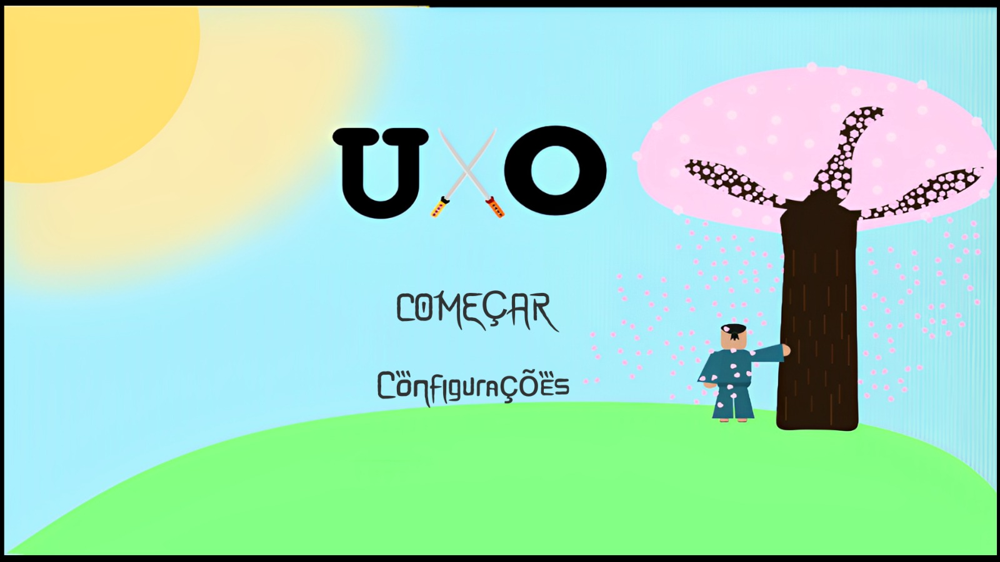
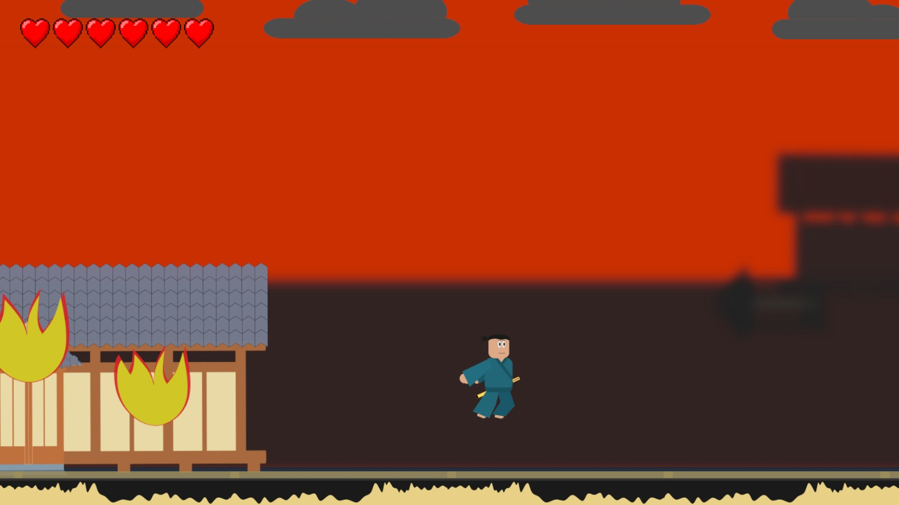
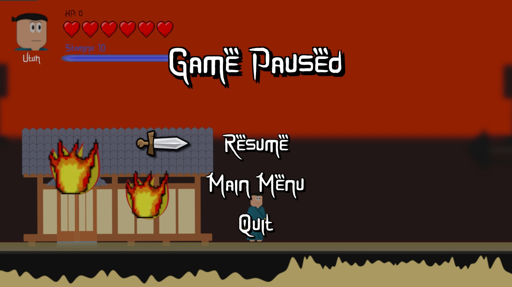

  

  
  
  
  
  
    
  
  
  

  [Intro](#a-introduction-to-the-history-of-uxo-beta) •
  [Game Production](#game-production-history) • [System Requirements](#system-requirements) •
  [Download](#download) • [Resources](#resources) • [Screenshots](#screenshots) •
  [Game Development](#development-progress) • [Credits](#credits--license)

---
# A Introduction to the History of UxO Beta
**UxO Beta** is a challenging 2D adventure and fighting game set in 1573, in the Kansai Region, Japan. It tells the story of one of the sons of the last commander of the Ashikaga Shogunate, who was brutally murdered in an attack on the city of the Oda clan, located in Kansai. The city was in ruins, there was no one to protect the citizens... Or was it? Said son had left moments before the attack to carry out a diplomatic mission in the neighboring clan, Azai. Upon returning to the city, he had the misfortune to see it in flames. Suffering hung over the entire city, even him. Arriving at the castle, the saddest scene of his life unfolded before his eyes: his entire family had been murdered.   
All of the family's belongings were stolen, including his great-great-grandfather's sword, _Heiwa_. A symbol of peace and prosperity, meant to offer people protection, would now be stained with blood. Next to his father's body, the following sentence was written on a plaque: "Onigama was here." By revealing himself, his father's killer had his days numbered, so he thought. After discovering that Onigama was still in the city, he gathered all the surviving soldiers and advanced against the great villain. Moments later, the late shogun's son found himself fleeing out of town after nearly being charred by a huge sphere of energy released by Onigama.   
Everyone had been exterminated: the citizens, his soldiers, his family... There was only him and his hatred left. Months after the tragedy, after intense training routines and endless planning for a successful attack against Onigama, he was ready to exact his revenge. It was kill or be killed; he no longer feared death, there was nothing to lose. After thinking of countless different strategies, he decided to start his attacks at Yawarakai Mori, a grove where a portion of Onigama's army was stationed, just in case they invaded his territory.

## Game Production History
From the beginning, the basic idea was always a 2D adventure, platform and difficult game, with frantic and insane fights. We decided to use the Unity game engine to develop it, due to its popularity and ease of work. For the graphics, firstly, we idealized them to be pixelated (this version can be found [here](https://github.com/AJUMP-Corp/UxO-Beta/tree/main/Old%20Version%20(test))), but due to some problems this idea was discarded. The team is currently working on a visual improvement for the main menu, while development on the second level of the game is underway.

## System Requirements
- Operational System: Windows 7 or later
- Processor: 1.5 GHz dual-core processor or equivalent
- RAM Memory: 2 GB or more
- Video Card: DirectX 9 (or better) compatible graphics card
- Storage: 500 MB of available disk space

## Download
1. Download the game [here](https://github.com/AJUMP-Corp/UxO-Beta/releases/download/beta/UxO-Beta.zip).
2. Extract the .zip file to the folder of your choice.
3. Run the "**UxO-Beta.exe**" file to launch the game.
> NOTE: See [how to play](./Technical%20Descriptions/CHARACTERS.md) to more informations.

## Resources
- Amazing 2D graphics.
- Immersive soundtrack.
- 1 epic character available to play.
- Challenging enemies, traps and bosses.
- 3 levels of pure adrenaline to explore.

## Screenshots

  
  
  

## Development Progress
- **Player**
  - [X] Collision system
    - [X] Floor and walls
    - [X] Damage mechanics (Enemies)
  - [X] Movement mechanics
    - [X] Basic walking
    - [X] Dash or dodge
  - [X] Player health
  - [X] Attack and damage enemies
  - [X] Way to enter a level
- **UI / General**
  - [X] Game Menu
    - [X] Main Menu
    - [X] Pause Menu
  - [X] Camera schematics
  - [X] Phases map
  - [X] Game audio
  - [ ] Intro scene
- **Enemies**
  - [X] Collision system
    - [X] Floor and walls
    - [X] Player damage
  - [X] Chases the player
  - [X] Attack on the player
  - [X] Movement mechanics (basic)
- **Bosses**
  - [X] Collision system
    - [X] Floor and walls
    - [X] Player damage
  - [X] Attack on the player
  - [X] Attack mechanics
- **Levels**
  - [X] Trap system
  - [X] Map environments
    - [X] Map 1 complete
    - [X] Map 2 complete
    - [X] Map 3 complete
  - [ ] Transition mechanics between levels

## Credits & License
- Project Management by [João Gabriel](https://github.com/JGabrielJ) and [Murilo Rodrigues](https://github.com/MuriloPensativo).
- Programming by [Pedro Cauan](https://github.com/Cauan87) and [João Gabriel](https://github.com/JGabrielJ).
- Map and Characters by [Ulisses dos Santos](https://github.com/Ulisses-Eufrauzino).
- Sounds by [Abraão Lucas](https://github.com/abraaolucassb).
> See more about our team [here](https://github.com/AJUMP-Corp).
> NOTE: This game is distributed under the [MIT license](https://github.com/AJUMP-Corp/UxO-Beta/blob/main/LICENSE). Please read the `LICENSE` file for more information about terms of use and distribution.

---
🎮🕹 **Curious to know if Ashikaga Yoshiaki's son will be able to satisfy his desire for revenge? Find out by playing and exploring the _UxO Beta_ challenges right now!**
