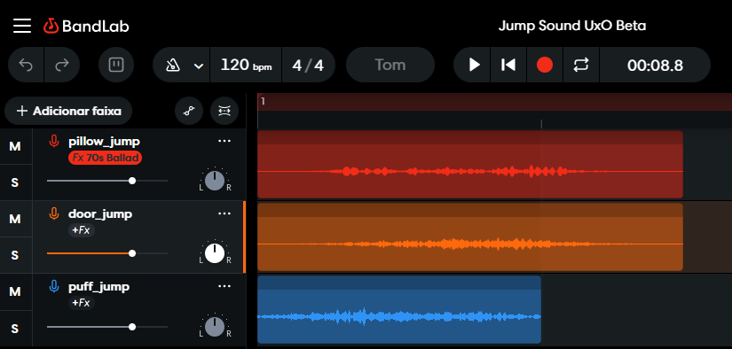

# Sounds Effects
We will show here how the construction of our general effects of the game UxO Beta was done.

## Jump
Jumping is a key element in many games, especially in platform games. It allows the player to reach higher areas, avoid obstacles and enemies, and collect items. In addition, the jump can be used to create interesting challenges and puzzles, increasing the fun and complexity of the game. In summary, jumping is an important mechanic that adds variety and depth to the gameplay.

The jump of our game was formed by 3 (three) sounds. Sound of a pillow, a door and a puff made by our Sound Engineer.

 
  

## Dash

