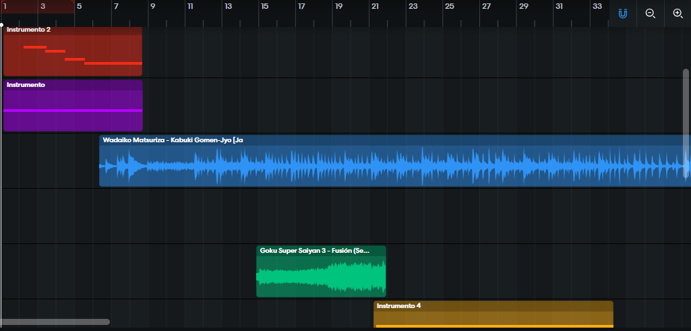

# Musical Themes
We will show here how the construction of our musical themes of the game UxO Beta was done.

## Why use Soundtracks?
The soundtrack is a key element in gaming, as it helps to create the right atmosphere, evoke emotions, and engage players in an immersive experience. Music is one of the pillars of a good game, and a good soundtrack and sound effects can leverage the success of the game and further hold players' attention. In addition, the musical themes and the sound ambience are fundamental for the conduction of the dynamics in the games, through immersion.

The soundtrack is a set of sounds from a work, which can be a commercial, a game, a movie, an episode of a series or soap opera, and even plays. This means that the soundtrack comprises other sounds such as dialogue and sound effects, in addition to music. When we talk about the music itself, we are talking about the musical score. This is the technical explanation. 

## UxO Musical Theme

The theme music for UxO Beta was based on Japanese culture, as the game is set in Japan. As a base I used the song "Wadaiko Matsuriza - Kabuki Gomen-Jyo" (this song can be found on YouTube). After putting this song at the base of my project, I then made melodies and a chord structure that would look good in the musical style of the Japanese drums. I also added special effects like Chinese gongs, and even Goku's scream when he transforms into Super Saiyan 3. Putting it all together formed a beautiful musical theme for our game. You can access this theme just below.

- UxO Musical Theme: [UxO Musical Theme](musical_themes/UxO_Musical_Theme.wav)

 
  

