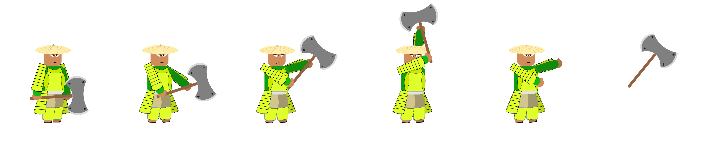
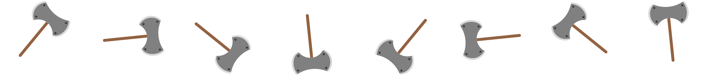
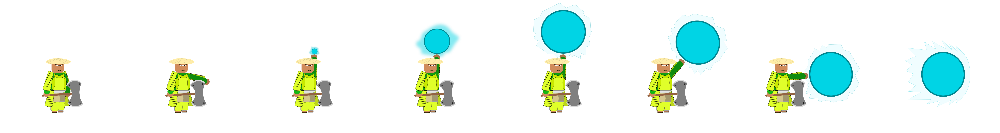
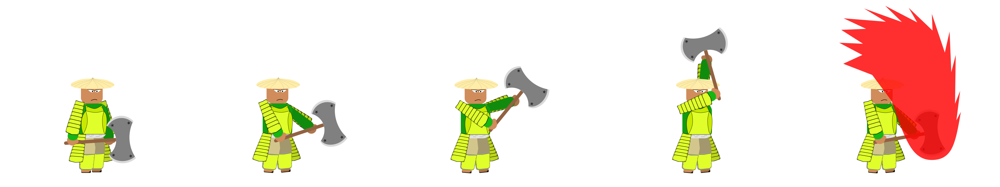
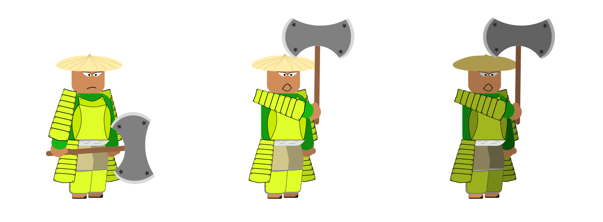
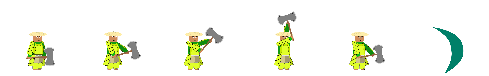
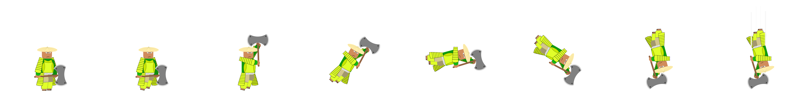

# Onigama
Onigama, the personification of the evil that plagues our game. This Machiavellian villain was the mastermind behind the devastating attack on the Utuh Shogunate. His presence chills your spine, being recognized from afar by the grandeur of his classic yellow samurai armor, which stands out harmoniously in contrast to his green clothing. Bearer of a cold and cruel character, his bloodthirsty reputation precedes each appearance. His imposing power is personified by a powerful axe, a fearsome weapon that has become synonymous with his cruelty and dominance over the dark forces that permeate our game universe.

## Onigama Throwing His Ax
This captivating sprite captures Onigama in full deployment of his initial attack in the opening phase of the confrontation. An imposing scene in which he skillfully throws his ax with formidable dexterity towards the player. The gravity and intensity of this pivotal moment are highlighted in the fluidity of the animation, offering an immersive look at Onigama's formidable basic attack that players will face throughout this early phase.

 
  

## Spinning Ax
This sprite represents Onigama's axe, spinning gracefully in the air after being thrown by his skilled hand. The axe's imposing, fluid dance captures the essence of the villain's raw strength and skill, providing a visually immersive take on this landmark moment in the game.

 
  

## Onigama Releasing Energy
In this expressive sprite, we witness Onigama executing a formidable energy attack. With mastery, he channels the vital force into his hands, delivering an impactful beam of energy against the player. The intensity and dexterity of this action are captured in detail, providing players with a visually impactful and immersive experience.

 
  

## Onigama Attack
"In this engaging sprite, Onigama executes an impressive downward attack against the player, repeating this action three times consecutively. The grandeur of this movement is masterfully portrayed, creating a visually dynamic sequence that challenges the player to face this formidable opponent in a series of calculated movements."

 
  

## Onigama Calling Allies
In this striking sprite, we observe Onigama summoning reinforcements to assist him in the confrontation with the protagonist. The scene conveys the tension of the moment, highlighting the villain's strategy in seeking support to face the main hero. The captivating visual representation portrays the imminent challenge that awaits the player, while Onigama intensifies the battle with cunning and planning.

 
  

## Onigama Launching a Wind Slash
In this intriguing sprite, we are treated to the vision of Onigama executing a precise cut, followed by launching a blade of wind towards the player. The fluidity of this movement is masterfully captured, conveying the skill and threat inherent to this formidable antagonist. This visual representation provides an immersive preview of the challenge that awaits players during their confrontation with Onigama.

 
  

## Onigama Hitting the Ground
In this captivating sprite, we witness Onigama unleash an extraordinary ability. Leaping to great heights, he leans gracefully before falling thunderously, wielding his ax to strike the ground with tremendous force. The resulting impact unleashes a formidable tremor, adding an epic dimension to the his imposing presence. This visually stunning scene promises to immerse players in a moment of grandeur and adrenaline during the confrontation with Onigama.

 
  

