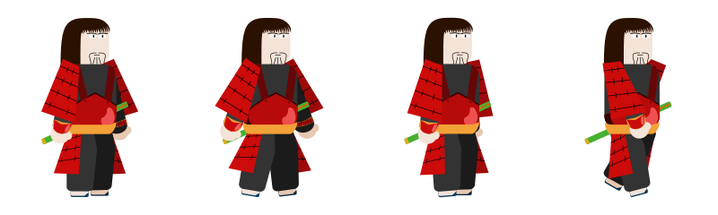
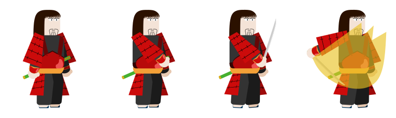
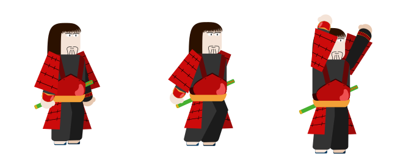
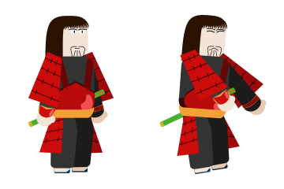
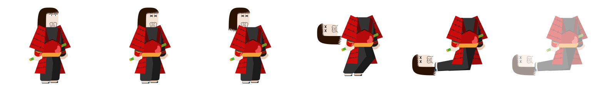

# Katanaji
The Katanajis, loyal members of Onigama's enemy ranks, are entry-level opponents. Featuring moderate agility and unexceptional strength, they are distinguished by their imposing red armor and skills with the fearsome katana.

## Katanaji Walking
This expressive sprite illustrates Katanaji in her steady stride. You will generally spot him when he begins his tireless pursuit of the player.

 
  

## Katanaji Attack
This striking sprite depicts the moment when Katanaji launches his ferocious attack against the player.

 
  

## Katanaji Jump
This engaging sprite captures the moment Katanaji soars into the air in a dynamic leap.

 
  

## Katanaji Stun
This touching sprite depicts Katanaji after being hit by a blow from the player.

 
  

## Katanaji Dying
This touching sprite records Katanaji's final moment, when he succumbs after enduring the player's relentless attacks.

 
  

