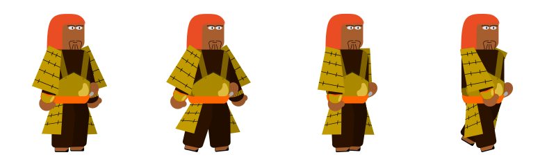
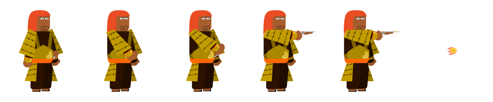
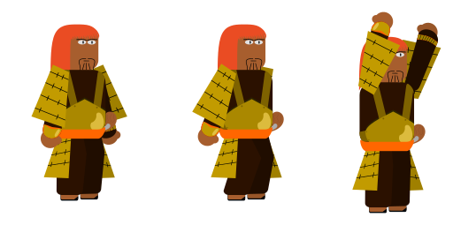
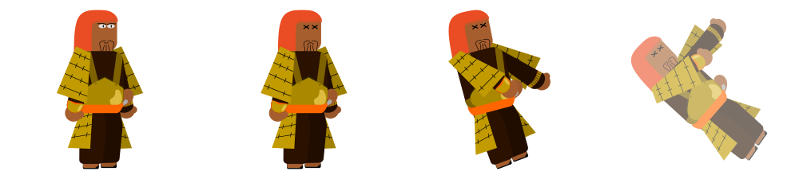

# Tanegashimiri
The Tanegashimiris, members of the formidable attack force in the service of Onigama, are specialized in the use of firearms. Although their strength and agility are not outstanding, the advantage of shooting from a distance allows them to inflict damage from a safe distance. They are easily recognizable by the distinctive yellow armor they wear.

## Tanegashimiri Walking
This expressive sprite illustrates Tanegashimiri in her steady stride. You will generally spot him when he begins his tireless pursuit of the player.

 
  

## Tanegashimiri Attack
This striking sprite depicts the moment when Tanegashimiri launches his ferocious attack against the player.

 
  

## Tanegashimiri Jump
This engaging sprite captures the moment Tanegashimiri soars into the air in a dynamic leap.

 
  

## Tanegashimiri Dying
This touching sprite records Tanegashimiri's final moment, when he succumbs after enduring the player's relentless attacks.

 
  

