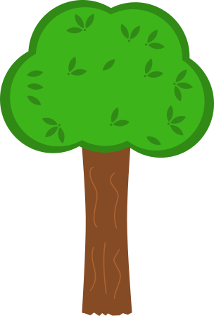
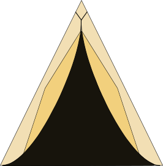
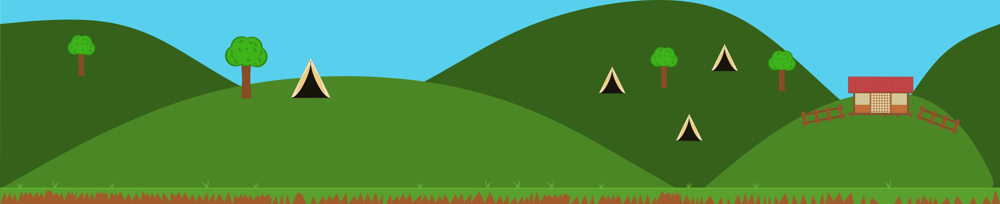
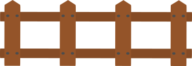
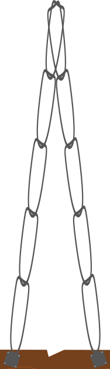
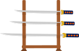
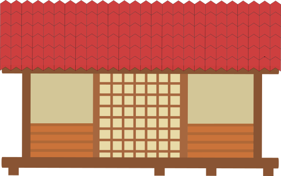
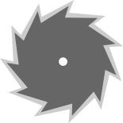
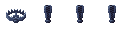

# General Sprites
Let's show our general sprites here.

## Tree

 
  

## Military Tent

 
  

## Forest Background Level 2

 
  

## Fence

 
  

## Level 2 Floor

 
  

## Log Trap

 
  

## Sword Keeper

 
  

## Background Level 2

 
  

## Garrison

 
  

## Big Cloud

 
  

## Middle Cloud

 
  

## Small Cloud

 
  

## Saw

 
  

## Bear Trap

 
  

## Stem

 
  

