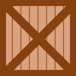
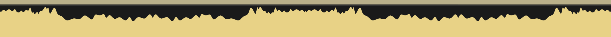
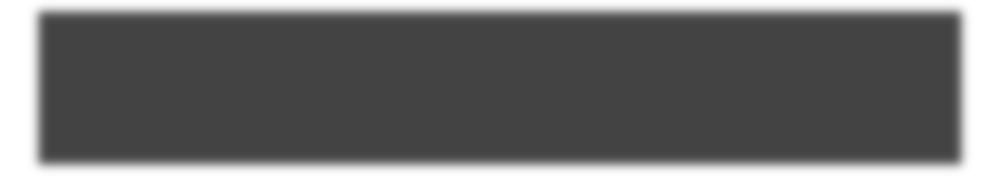

# General Sprites
Let's show our general sprites here.

## Box

 
  

## House on Fire

 
  

## House on Fire

 
  

## Black House
A house that is distant and blackened by smoke.

 
  

## Black House
A house that is distant and blackened by smoke.

 
  

## Floor

 
  

## Black Floor
A distant ground blackened by smoke

 
  

## Background Level 1

 
  

## Big Cloud of Smoke

 
  

## Middle Cloud of Smoke

 
  

## Small Cloud of Smoke

 
  

